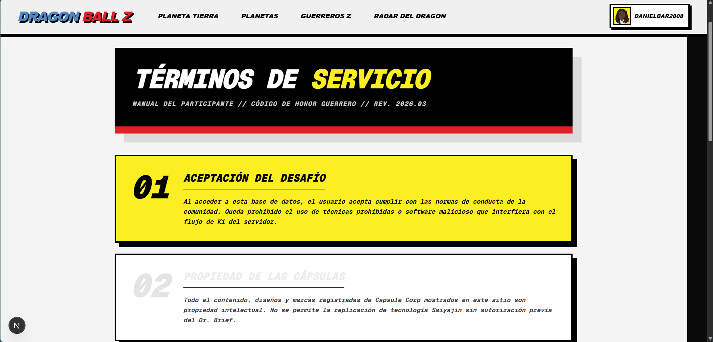
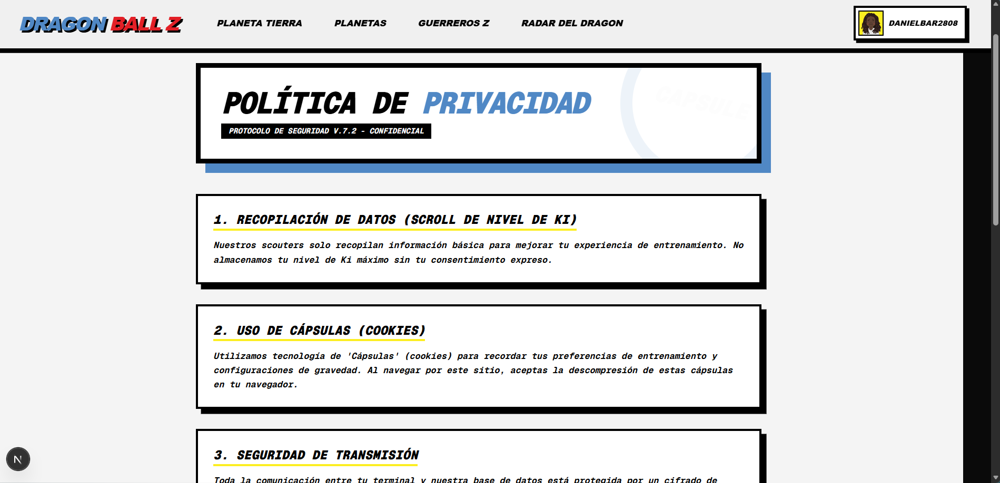
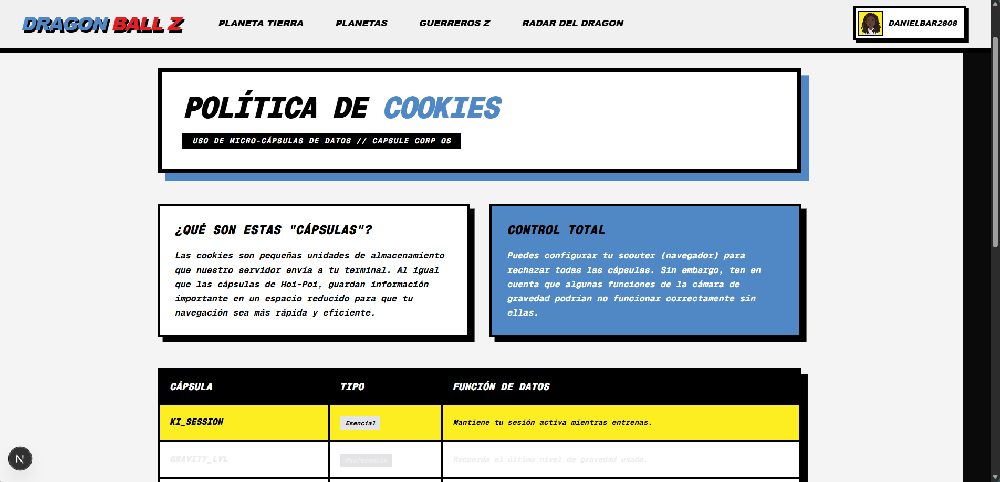

# 🐉 Dragon Ball Explorer App


Una aplicación web interactiva desarrollada con **Next.js**, **React** y **Tailwind CSS**. Este proyecto consume la [API oficial de Dragon Ball](https://web.dragonball-api.com/documentation) para ofrecer una experiencia inmersiva explorando personajes, planetas, transformaciones y elementos icónicos del universo de Dragon Ball.

## 🚀 Características Principales

- **Exploración del Universo:** Descubre y visualiza información detallada de los Guerreros Z, planetas y razas.
- **Buscador Integrado:** Encuentra rápidamente a tu personaje favorito o planeta mediante una barra de búsqueda centrada.
- **Modales e Interacciones:** Interfaces detalladas a través de modales para líneas evolutivas y características de personajes y planetas.
- **Autenticación (Supabase):** Formularios de inicio de sesión y registro para usuarios.
- **Diseño Temático:** UI completamente orientada a Dragon Ball (Radares, Cámaras de gravedad, Control de Ki, etc.).

## 🛠️ Tecnologías

- **Frontend:** Next.js (App Router), React 19, Tailwind CSS v4.
- **Backend / Auth:** Supabase.
- **API Externa:** [Dragon Ball API](https://web.dragonball-api.com/).

---

## 📸 Capturas de Pantalla

### 🌍 Planeta Tierra (Inicio)


### 🪐 Exploración de Planetas
Visualiza los planetas, usa filtros personalizados e interactúa con modales de información:


### 🥋 Personajes y Guerreros Z
Explora el catálogo de personajes, sus líneas evolutivas y su origen planetario:


### 🔥 Transformaciones y Entrenamiento
Conoce las fases del Super Saiyajin, fusiones y el control del Ki:


### 🛸 Tecnología y Objetos Clave


### 🔐 Autenticación
Sistema integrado de Registro e Inicio de Sesión:


### 📄 Páginas Legales e Informativas
Secciones de información legal, términos y políticas de uso del proyecto:




---

## 📋 Lista de Tareas (Roadmap) Original y Avances

- [x] Consumir la API de Dragon Ball.
- [x] Crear componentes: Navbar y Footer.
- [x] Implementar componente de Barra de Búsqueda y posicionarlo en el medio.
- [x] Renderizado principal de las páginas con `<Cards />` del consumo de la API.
- [x] Crear páginas para cada categoría (Planetas, Tecnología, Super Saiyajin, etc.).
- [x] Ajustar colores (textos oscuros en las nuevas páginas, cookies y términos).
- [x] Crear y vincular las vistas/componentes de Login y Registro.
- [x] Incorporar el Login/Register en el Navbar para fácil acceso.
- [x] Finalizar el uso de **Supabase** para la autenticación, inicio de sesión y registro del usuario (listo).

---

## 💻 Instalación Local

```bash
# 1. Clonar el repositorio
git clone <URL_DEL_REPO>
cd dragon-ball

# 2. Instalar las dependencias
npm install

# 3. Configurar variables de entorno (.env.local)
# Para Supabase, crea las variables requeridas por tu proyecto:
# NEXT_PUBLIC_SUPABASE_URL=...
# NEXT_PUBLIC_SUPABASE_ANON_KEY=...

# 4. Levantar el servidor de desarrollo
npm run dev
```

Visita [http://localhost:3000](http://localhost:3000) en tu navegador para ver la página.